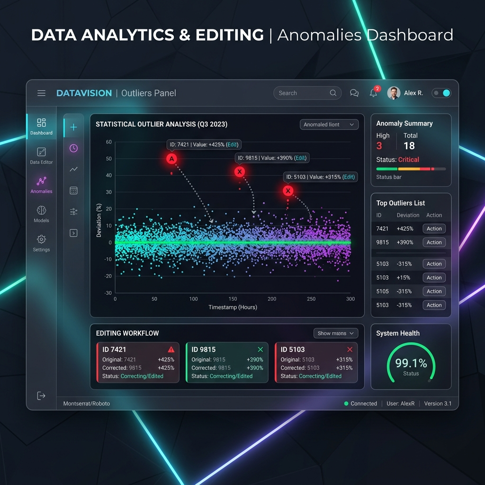

# Case Study 2: Editing & Outlier Mitigation

## Overview
Real-world microdata contains extreme anomalies. This module intelligently identifies statistical outliers (shown in red) using algorithms like Hidiroglou-Berthelot, capping them to preserve data integrity rather than simply dropping the records.
