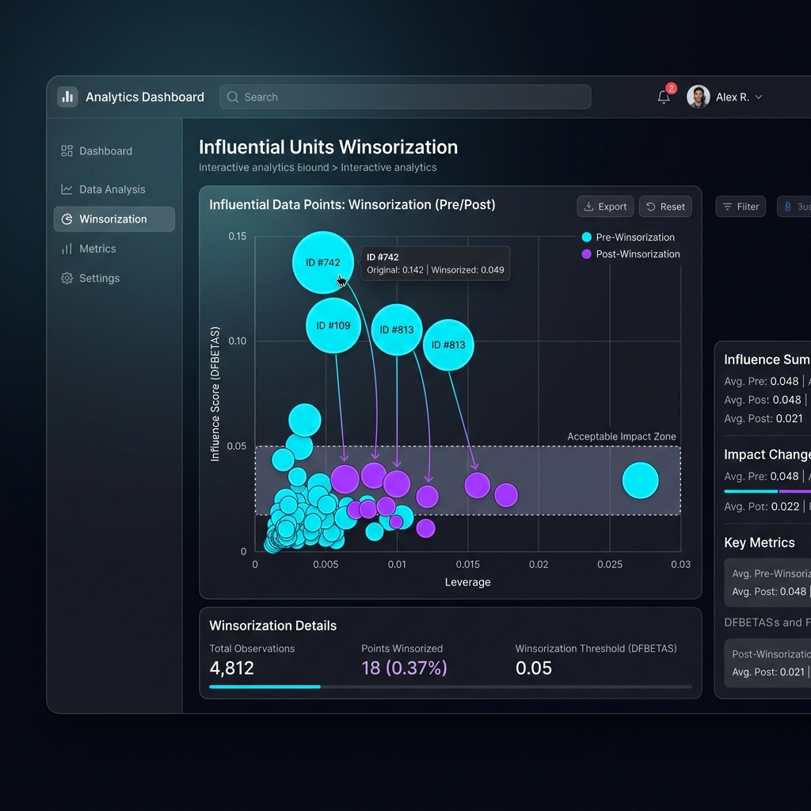

# Case Study 4: Influential Units Winsorization

## Overview
Some units carry excessive survey weights combined with extreme values, heavily distorting estimates. This module detects these influential units using Conditional Bias and shrinks their impact (winsorization) to stabilize downstream aggregations.
