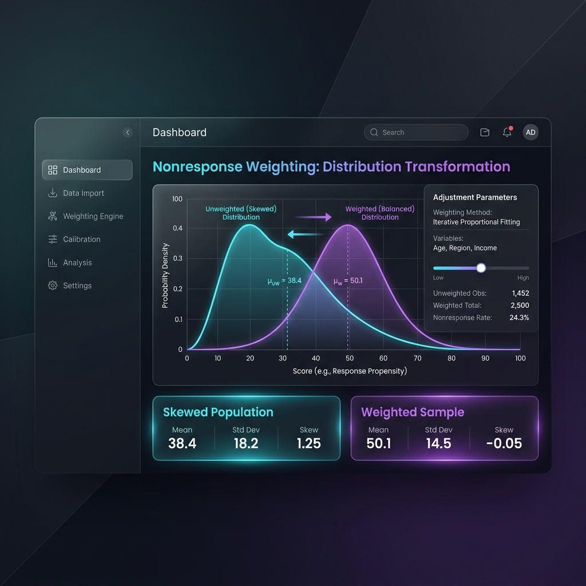

# Case Study 5: Nonresponse Weighting

## Overview
To counteract systematic nonresponse bias, this module dynamically creates Response Homogeneity Groups (RHGs) and applies inverse probability weighting. The chart shows how the unweighted, skewed sample is adjusted to form a balanced representative curve.
