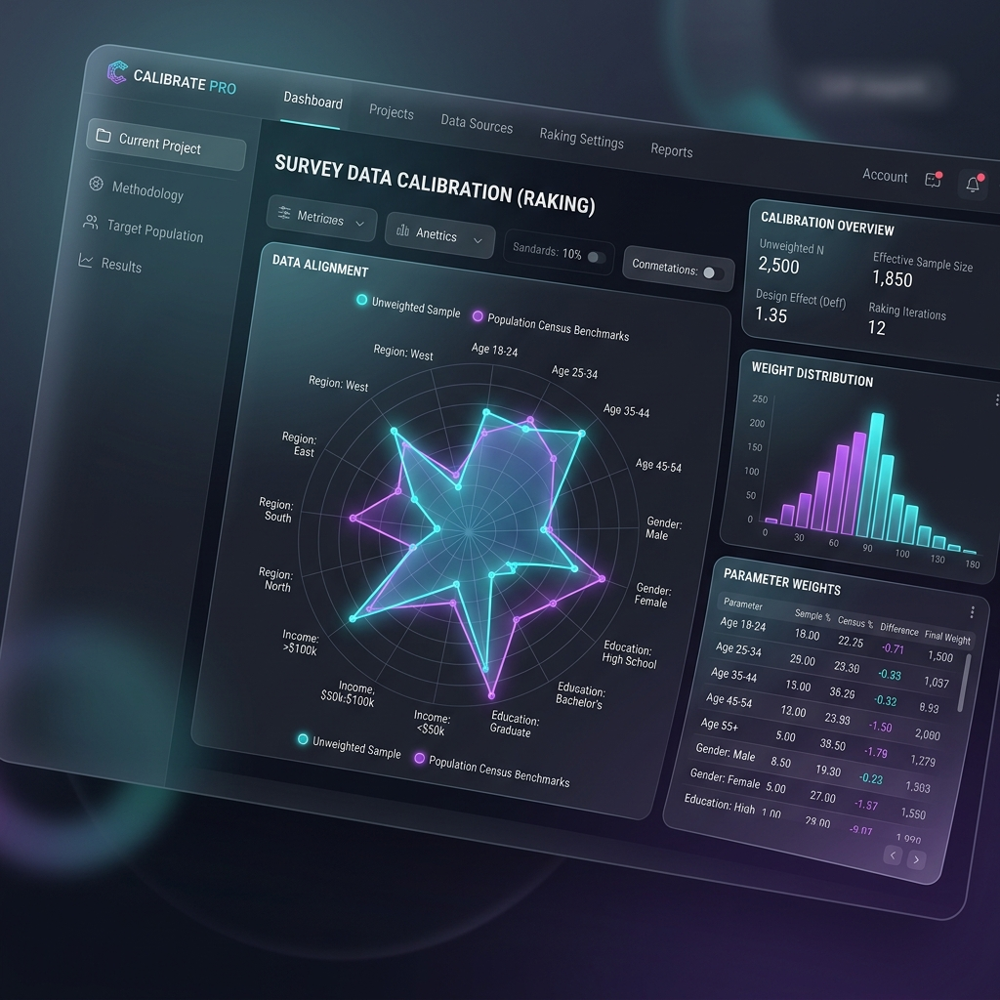

# Case Study 6: Calibration & Raking

## Overview
Survey samples rarely match the true population benchmarks perfectly. The calibration module applies Iterative Proportional Fitting (Raking) to force the sample totals to align perfectly with known census constraints.
