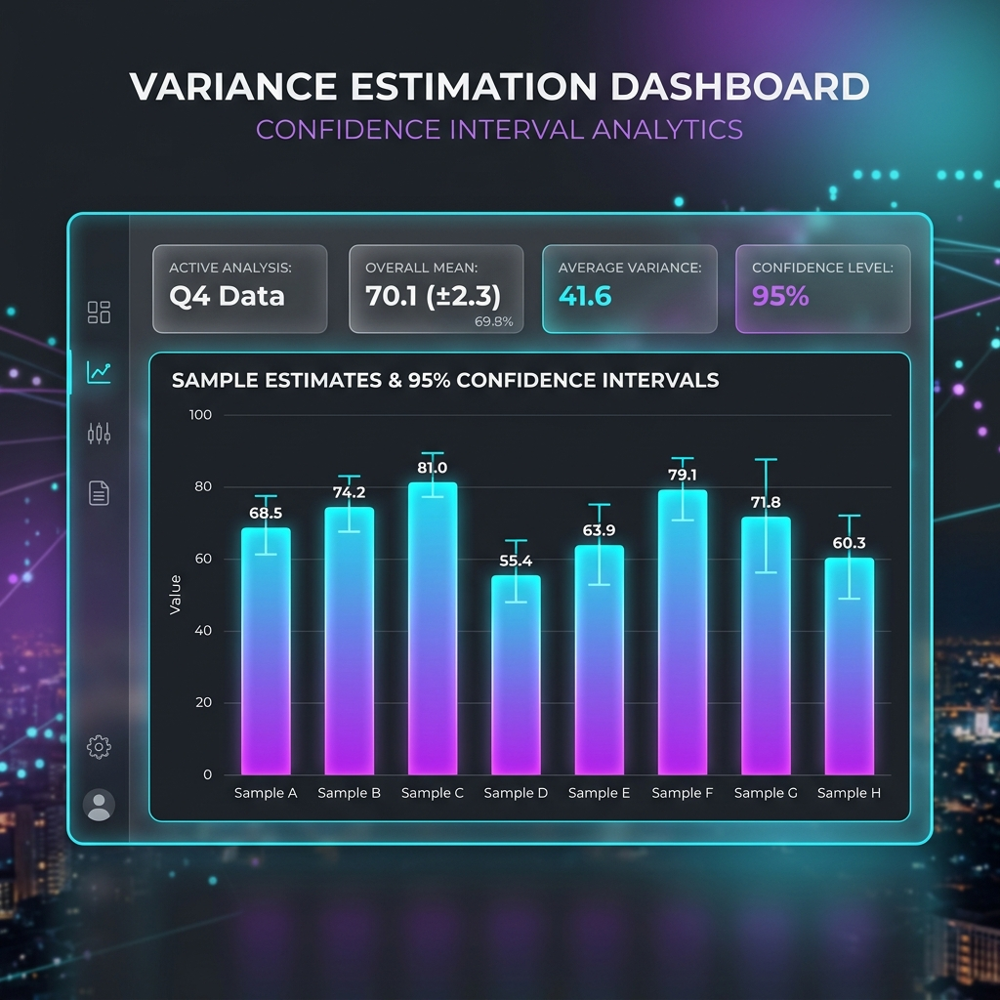

# Case Study 7: Variance Estimation

## Overview
Providing a point estimate is useless without measuring its precision. The analytical variance module calculates standard errors and 95% confidence intervals, accounting for the complex survey design and prior weighting stages.
