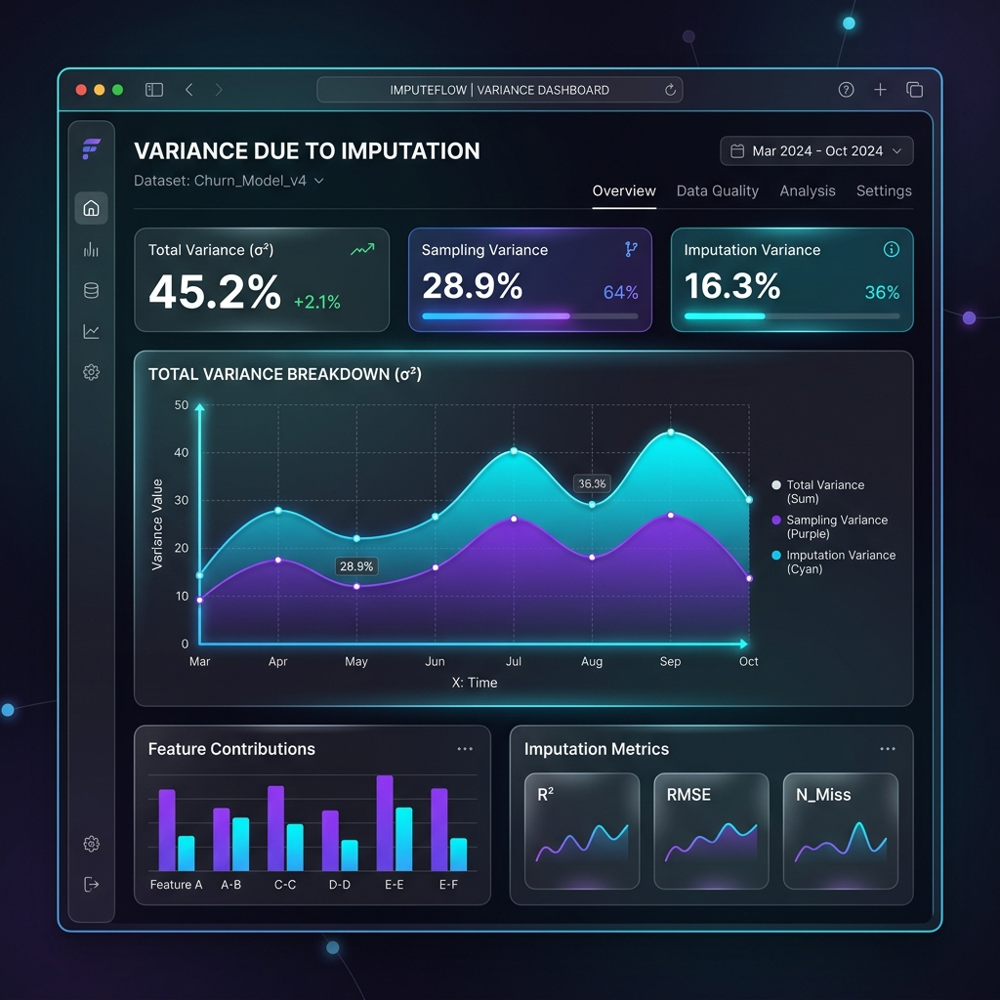

# Case Study 8: Variance Due to Imputation

## Overview
Standard variance estimation assumes all data is observed. This specialized module calculates the extra variance injected by the imputation process itself, isolating it from the baseline sampling variance.
