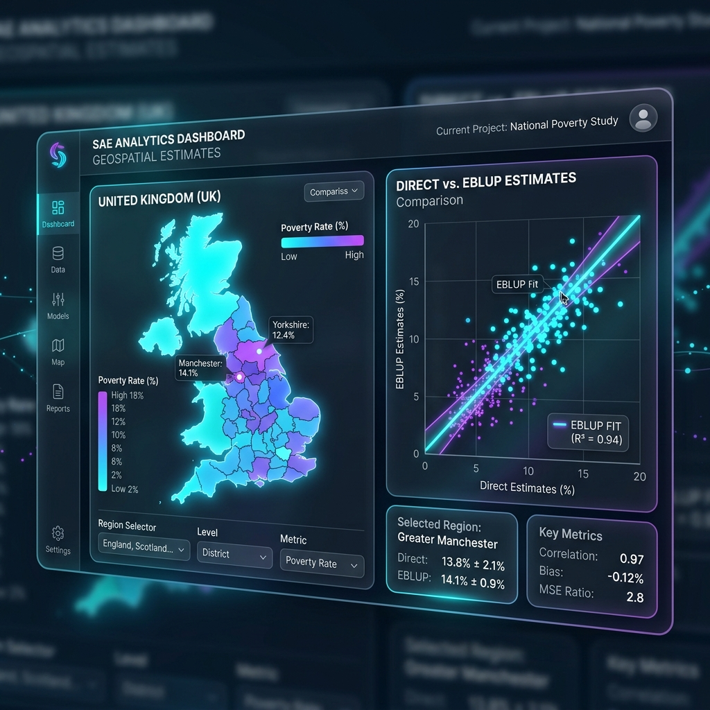

# Case Study 9: Small Area Estimation (SAE)

## Overview
Direct estimates for small geographic domains are often highly volatile due to small sample sizes. The SAE module borrows strength across regions using EBLUP or Hierarchical Bayes models to produce reliable, smoothed estimates.
