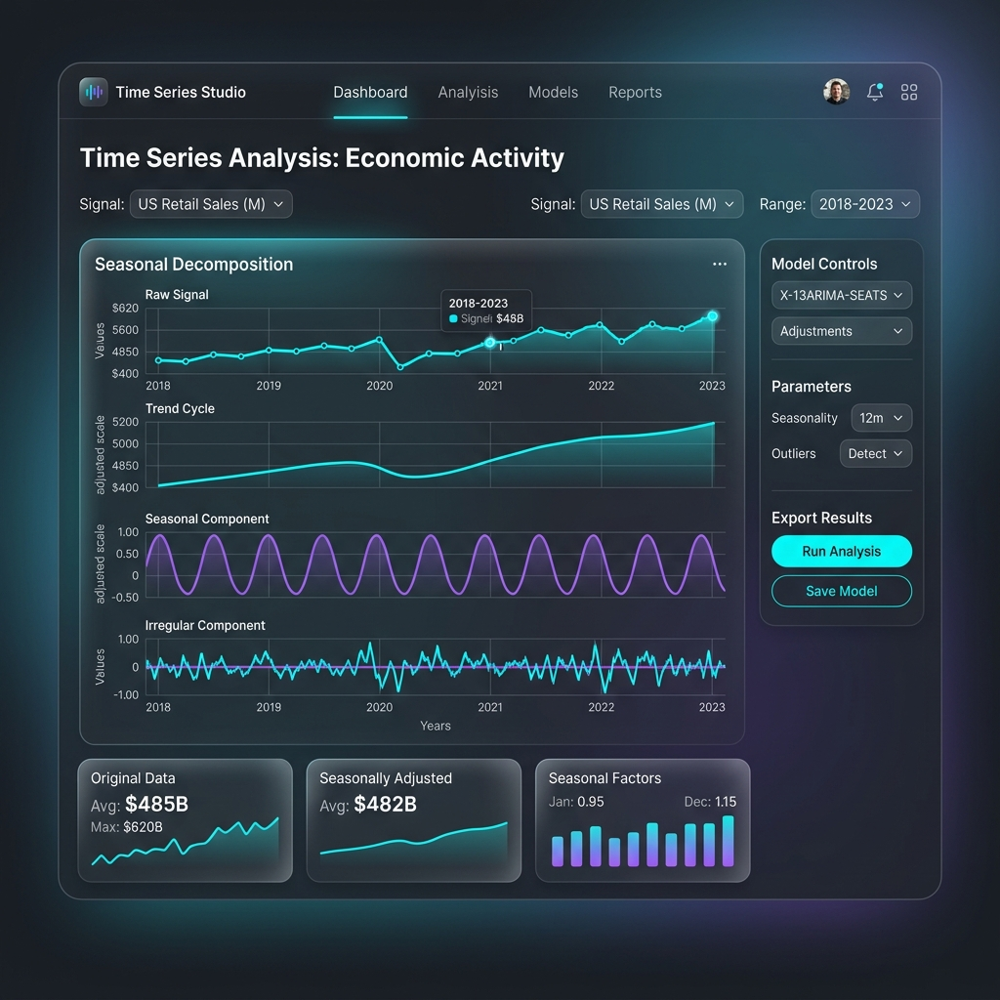

# Case Study 10: Seasonal Adjustment

## Overview
Economic indicators fluctuate due to seasonal patterns. This module decomposes the raw signal into Trend, Seasonal, and Irregular components, allowing analysts to observe the true underlying movement of the data.
