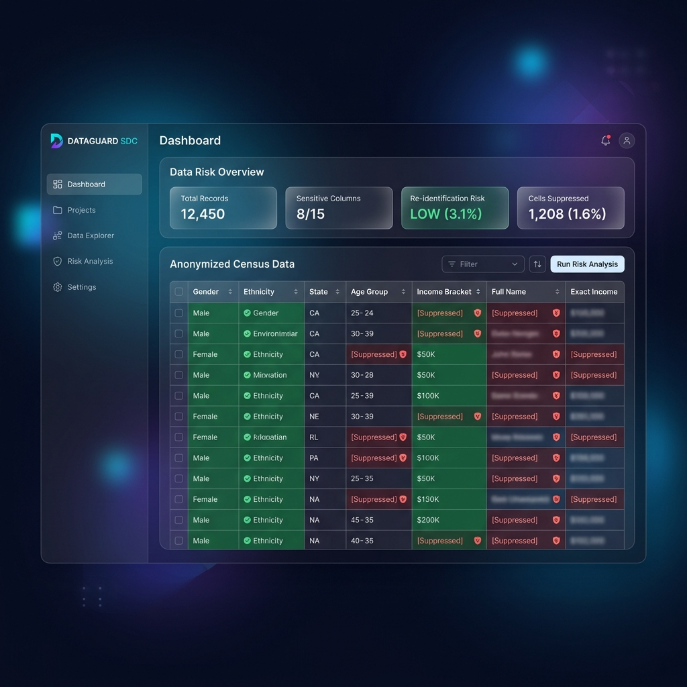

# Case Study 11: Statistical Disclosure Control

## Overview
Before publishing microdata, the engine ensures total privacy. The Statistical Disclosure Control (SDC) module detects sensitive cells and applies tabular suppression or differential privacy, preventing the re-identification of any individual entity.
