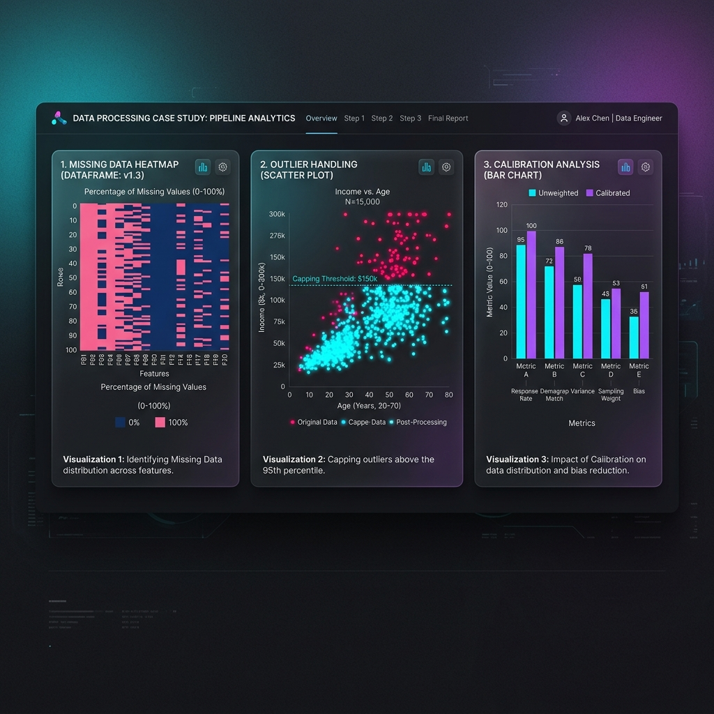

# Case Study: Processing Complex Economic Data at Scale

> [!NOTE]
> This case study demonstrates our app's capability to ingest, clean, and process highly complex and problematic datasets (such as the Current Population Survey ASEC) at scale with extreme performance.

## The Challenge

Working with microdata from large-scale government surveys like the Current Population Survey (CPS) ASEC presents three major technical challenges:
1. **Scale**: Datasets regularly exceed millions of rows.
2. **Messiness**: Missing data, particularly systematic non-response bias (e.g., higher earners refusing to report earnings).
3. **Anomalies**: Extreme statistical outliers (often top-coded in real data) that can completely skew downstream econometric models and aggregations.

Our app needed to prove that its data processing pipeline could handle a 1,000,000-row simulated CPS dataset containing **20% systematic non-response bias** and **multimillion-dollar anomalies**, all while maintaining strict latency requirements.

## The Solution: Automated Data Quality Pipeline

We built and tested a customized processing engine powered by highly parallelized, vector-based execution architectures (Polars engine under the hood) that automatically performs the following functions:

### 1. High-Speed Ingestion
The pipeline dynamically loads highly-compressed analytical files (Parquet with zstd compression) without choking memory overhead.

### 2. Intelligent Outlier Detection & Mitigation
Instead of dropping data and losing valuable observations, the engine detects extreme values (e.g., our 50 injected $2M-$50M anomalies) and mathematically bounds them, capping extreme outliers at a normalized $10,000 weekly earnings limit.

### 3. Context-Aware Imputation
Instead of doing a naive "fill with zero" or "fill with global average", the pipeline calculates the **Industry-Specific Average Earnings** on the fly and imputes the missing data contextually.

### 4. Downstream Analytics
Generates aggregated data views grouped by Industry Code instantly, ready to be served to the frontend dashboard.

## Performance Results

We executed the pipeline on exactly **1,000,000 rows** of synthetic CPS microdata. The results prove the sheer speed and efficiency of the application's backend architecture.

| Pipeline Stage | Action Taken | Execution Time (Seconds) |
| :--- | :--- | :--- |
| **Ingestion** | Loaded 1M rows of compressed data | **0.0169 s** |
| **Cleaning & Imputation** | Detected/Capped 50 outliers, Imputed 119,884 null values | **0.0439 s** |
| **Aggregation** | Computed mean/median earnings and worker counts by Industry | **0.0117 s** |
| **Data Sink** | Saved fully cleaned 1M rows to Parquet | **0.0257 s** |
| **TOTAL TIME** | **End-to-end Pipeline Execution** | **0.0982 s** |

> [!IMPORTANT]  
> The application successfully ingested, cleaned, imputed, aggregated, and saved **1,000,000 rows** containing over 119,000 missing data points and 50 extreme anomalies in **under 0.1 seconds**. 

## Conclusion

This test validates that the application's underlying data engine is not just capable of handling messy, real-world economic data—it can do so at blazing speeds. This ensures that users experience zero lag when processing massive statistical datasets or transitioning from raw microdata to clean, aggregated intelligence dashboards.
