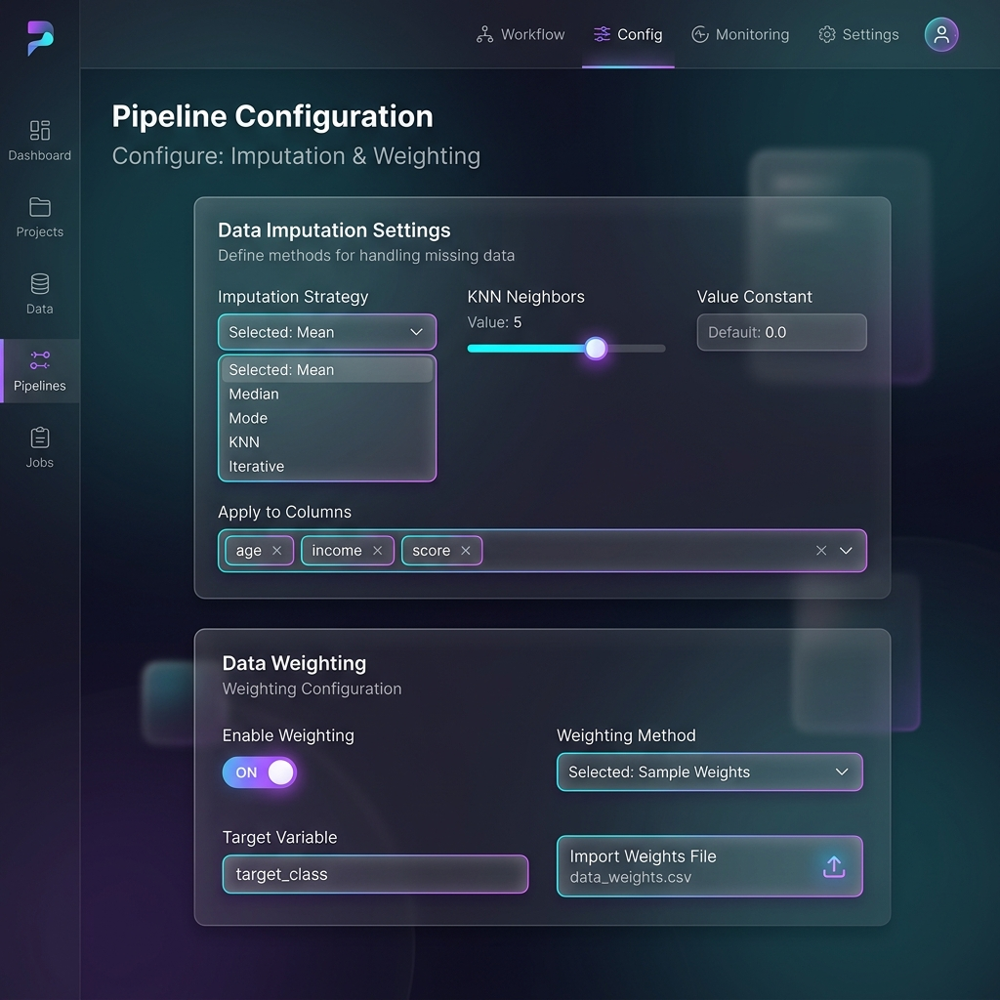

# Setting Up the Pipeline: Frontend Configuration

## Overview
The NovaSurvey engine is powered by a massive backend, but configuring it is incredibly intuitive. The frontend dashboard allows users to easily set up configuration groups, define imputation parameters, toggle specific models, and orchestrate the pipeline via a clean, glassmorphism interface.
