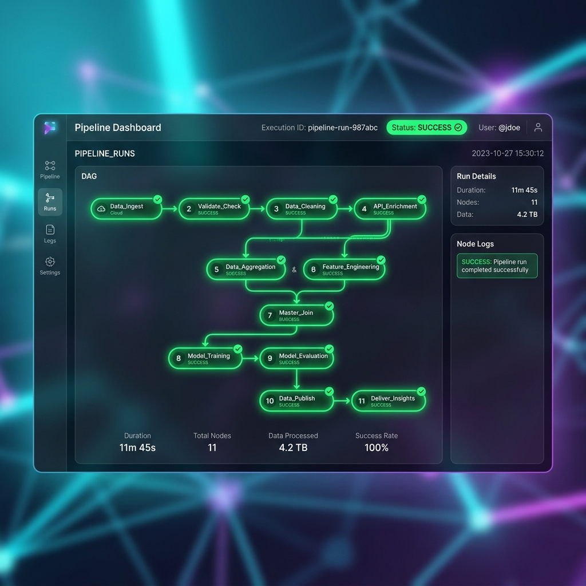

# Case Study: Full Pipeline Orchestration

## Overview
The true power of the NovaSurvey engine lies in its unified orchestration. This dashboard displays the execution DAG (Directed Acyclic Graph) of the full pipeline running end-to-end. Data flows seamlessly from ingestion, through all 11 statistical modules, directly into secure publishing formats.
